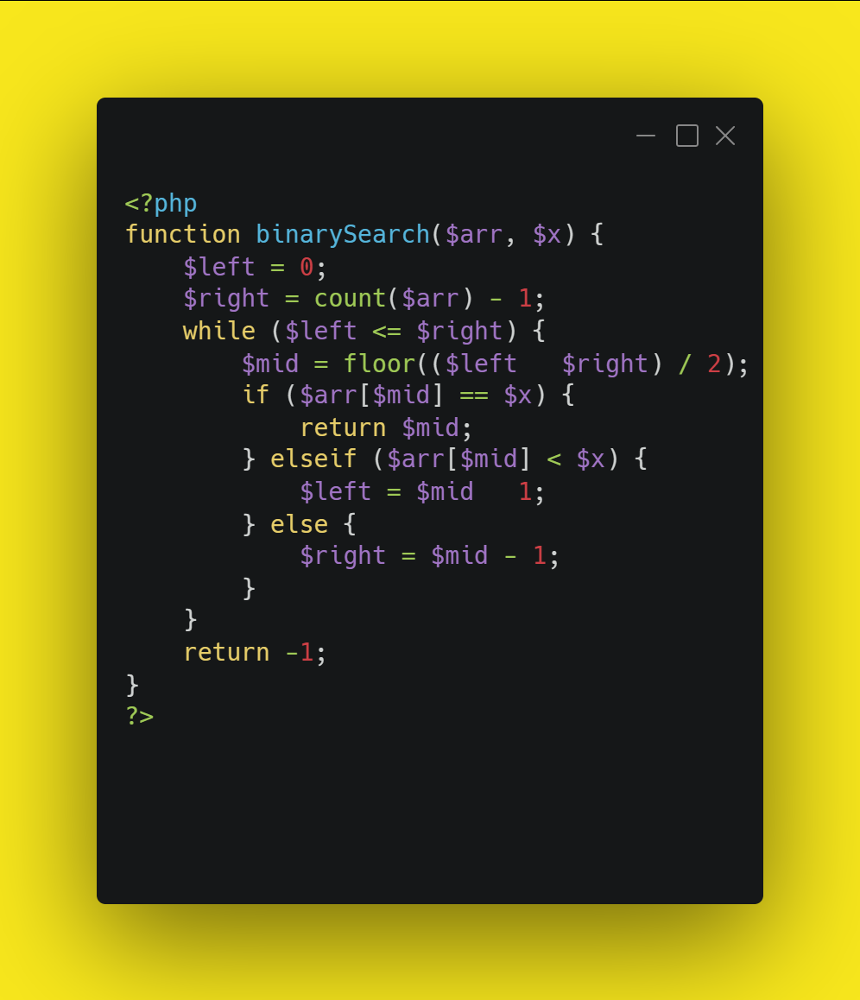
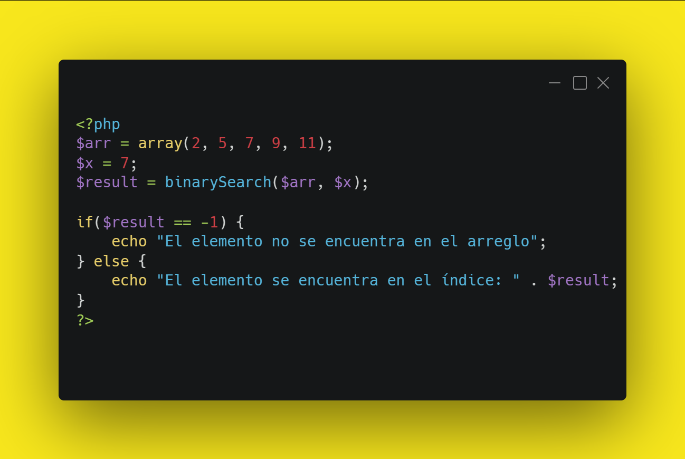

# Proponme un algoritmo de búsqueda y codifícalo en PHP

## GitHub Copilot

Claro, uno de los algoritmos de búsqueda más comunes es el algoritmo de búsqueda binaria. Este algoritmo es muy eficiente para buscar elementos en una lista ordenada. Aquí te dejo el código en PHP:

Este código toma un arreglo ordenado y un elemento a buscar, y devuelve el índice del elemento si se encuentra en el arreglo, o -1 si no se encuentra.

Para utilizar el algoritmo de búsqueda binaria en tu proyecto de PHP, primero debes tener un arreglo ordenado en el que quieras buscar un elemento. Luego, puedes llamar a la función binarySearch que definimos anteriormente, pasando como argumentos el arreglo y el elemento que deseas buscar. La función devolverá el índice del elemento si se encuentra en el arreglo, o -1 si no se encuentra.

Aquí te dejo un ejemplo de cómo podrías utilizar la función binarySearch en tu proyecto de PHP:

En este ejemplo, estamos buscando el elemento 5 en el arreglo [1, 3, 5, 7, 9]. La función binarySearch devolverá el índice 2, que es donde se encuentra el elemento 5 en el arreglo. Luego, simplemente verificamos si el índice es -1 para saber si el elemento se encontró o no en el arreglo.

> Si consideras útil esta información, apóyalo haciendo "★ Star" en el repositorio. ¡Gracias 🙌!

## Historia

En 1946, John Mauchly mencionó por primera vez la búsqueda binaria como parte de Moore School Lectures, el primer conjunto de conferencias relacionado con las computadoras. Las siguientes publicaciones mencionaban que la búsqueda binaria solo funcionaba en arreglos cuya longitud fuese de uno menos que una potencia de dos hasta 1960, cuando Derrick Henry Lehmer público un algoritmo de búsqueda binaria que funcionaba en todos los arreglos ordenados. En 1962, Hermann Bottenbruch presentó en ALGOL 60 una implementación del algoritmo de búsqueda binaria en el cual colocaba la comparación de igualdad en el final del algoritmo, incrementando el número promedio de iteraciones por uno, pero reduciendo a uno el número de comparaciones por iteración. La búsqueda binaria uniforme fue presentada a Donald Knuth en 1971 por A. K. Chandra de la universidad de Stanford y publicado en el libro de Knuth: The Art of Computer Programming. En 1986, Bernard Chazelle y Leonidas J. Guibas introdujeron cascada fraccional, una técnica usada para acelerar la búsqueda binaria en múltiples arreglos.