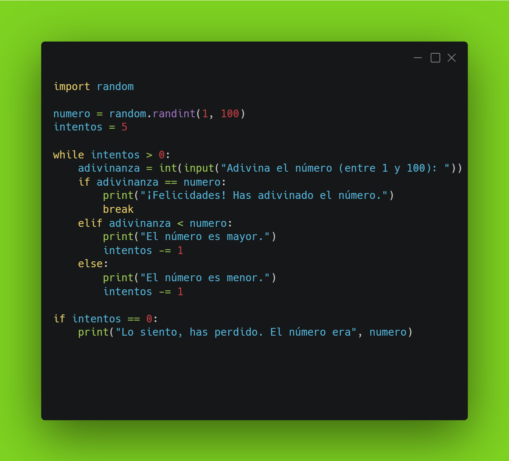
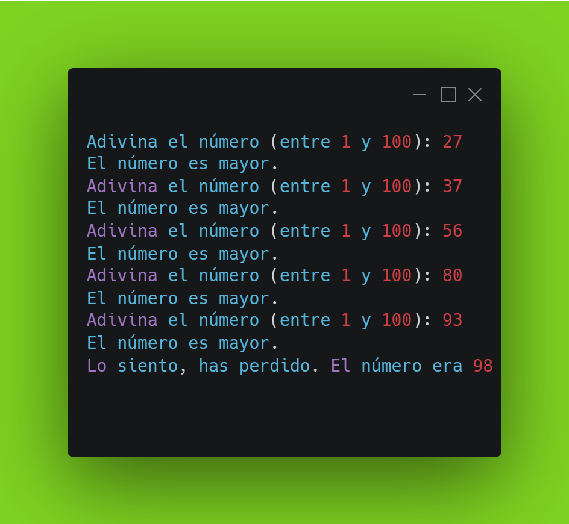

# Desarrolla un Juego para adivinar un número del 1 al 100 con 5 intentos y pista si es menor o mayor en Python

## GitHub Copilot

Claro, aquí te dejo un pseudocódigo para que puedas implementar el juego en <strong>Python</strong>:

- Generar un número aleatorio entre 1 y 100.
- Pedir al usuario que adivine el número.]
- Si el número adivinado es igual al número generado, mostrar un mensaje de felicitación y terminar el juego.
- Si el número adivinado es menor que el número generado, mostrar un mensaje indicando que el número es menor y restar un intento.
- Si el número adivinado es mayor que el número generado, mostrar un mensaje indicando que el número es mayor y restar un intento.
- Si el usuario se queda sin intentos, mostrar un mensaje indicando que ha perdido y mostrar el número generado.

### Aquí te dejo el código en Python:

### Aqui puedes ver como se juega:

> Si consideras útil esta información, apóyalo haciendo "★ Star" en el repositorio. ¡Gracias 🙌!

## Historia

En la Segunda Guerra Mundial el matemático británico Alan Turing había trabajado junto al experto en computación estadounidense Claude Shannon para descifrar los códigos secretos usados por los submarinos alemanes U-Boot. Las ideas de ambos científicos, que ayudaron a establecer las bases de la moderna teoría de la computación, señalaban la inteligencia artificial como el campo más importante hacia el que había que dirigir todos los esfuerzos de investigación. En 1949 Shannon presentó un artículo científico en una convención de Nueva York titulado Programming a Computer for Playing Chess donde presentaba muchas ideas y algoritmos que son utilizados todavía en los programas modernos de ajedrez.nota 2​ Turing, en colaboración con D. G. Champernowne, había escrito ya en 1948 un programa de ajedrez que no pudo ser implementado, puesto que no existía un ordenador con la potencia suficiente para ejecutarlo, pero en 1952 puso a prueba su programa simulando los movimientos de la computadora. El programa perdió una primera partida frente a Alick Glennie, un colega de Turing, pero ganó la segunda frente a la esposa de Champernowne, sentando las bases prácticas de los programas de ajedrez modernos.10​nota 3​

Nimrod, de John Bennet (1951).

Tras la desaparición de Alan Turing distintos investigadores continuaron sus trabajos, implementando nuevos programas de ajedrez y otros juegos más sencillos. En 1951 un trabajador de la empresa Ferranti, el australiano John Bennett, presentó en una feria británica su Nimrod, un enorme computador capaz de jugar al nim que se había inspirado en el Nimatron, una máquina electromecánica presentada once años antes.nota 4​ La máquina generó una entusiasta aceptación, pero fue desmontada por Ferranti para utilizar sus piezas en otros proyectos más serios.11​

OXO, de Alexander Douglas (1952).

Otro juego que se había implementado tempranamente era el de las tres en raya, que Alexander Douglas había recreado en el EDSAC de la University of Cambridge en 1952 como parte de su tesis doctoral. OXO incorporaba gráficos muy similares a los actuales y aunque fue mostrado únicamente a unos pocos estudiantes de la Universidad, es considerado por algunos como el primer videojuego moderno de la historia.11​nota 5​ Ese mismo año Arthur Samuel también había realizado un programa capaz de jugar a las damas aprendiendo de sus errores que había implementado en un IBM 701; Samuel pasó los siguientes años refinando su programa y finalmente, en 1961, consiguió que venciese a los campeones estadounidenses del juego.

