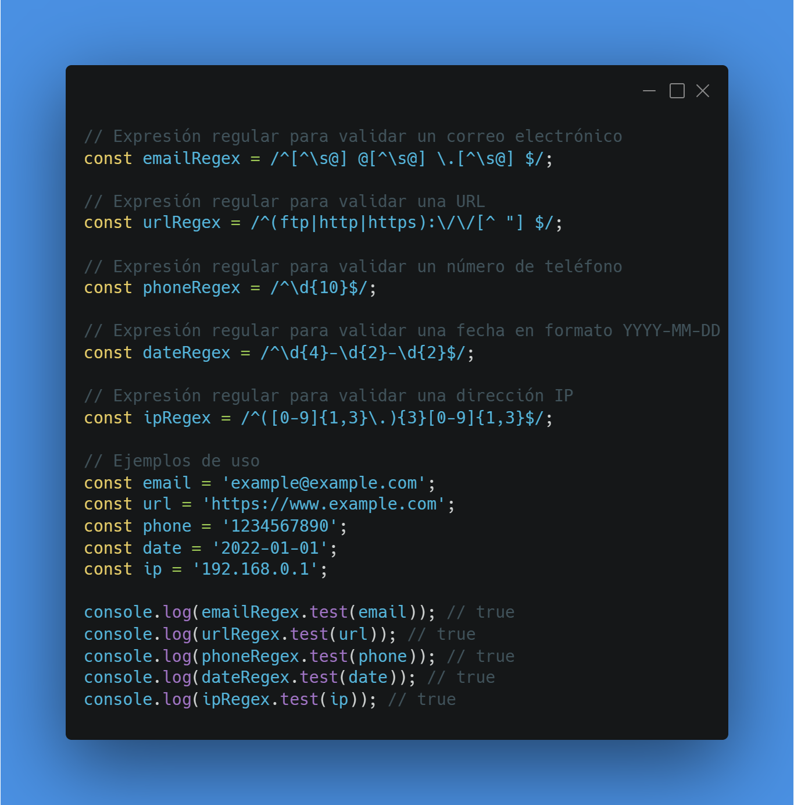
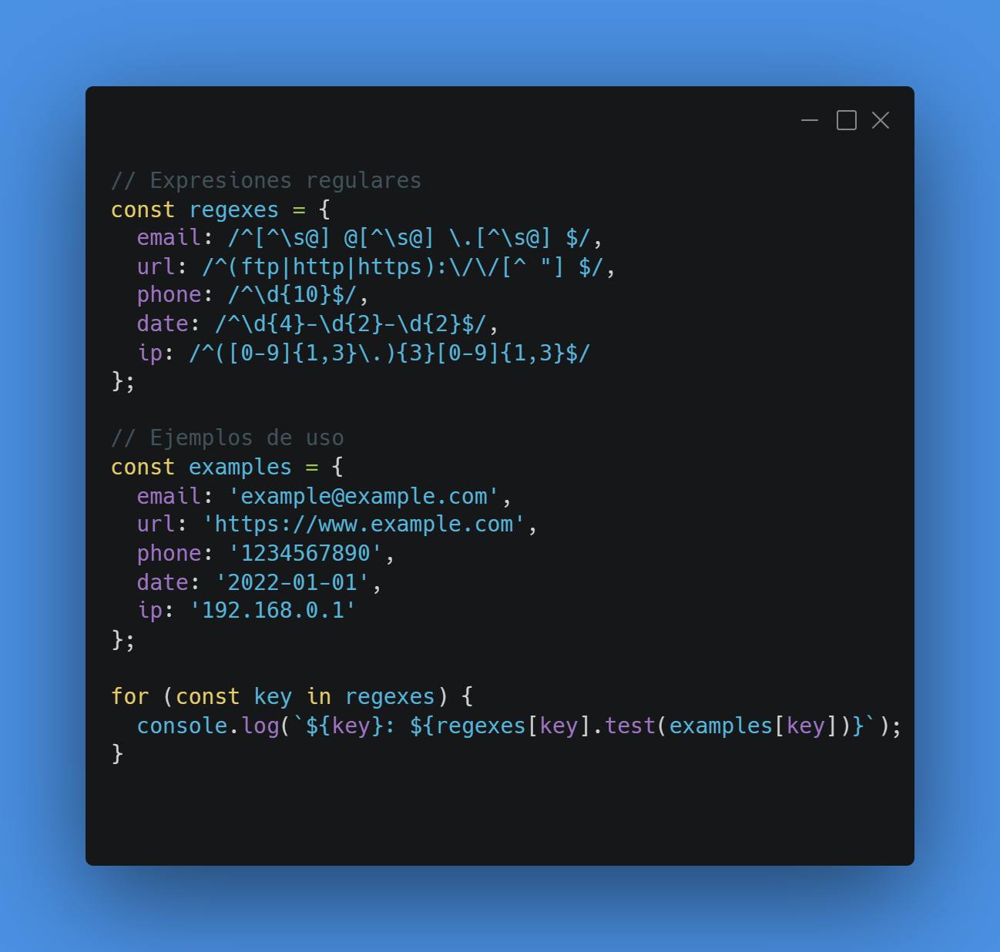
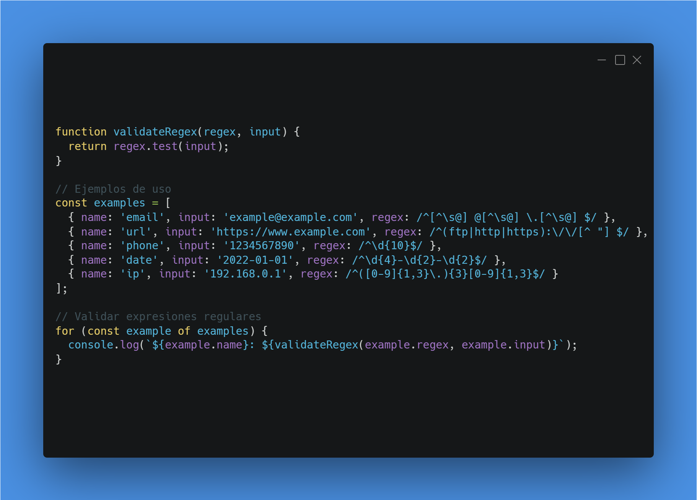
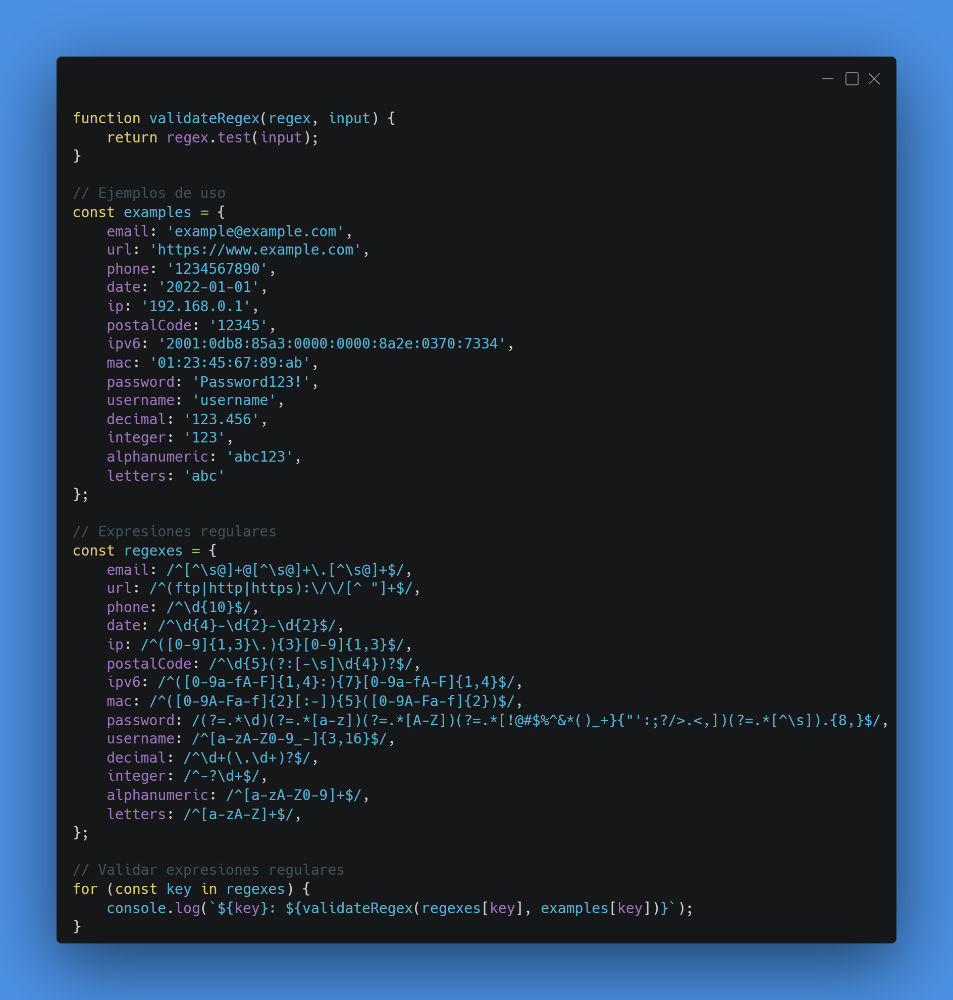

# Haz un programa que valide mediante las principales y más usadas expresiones regular en javascript

## GitHub Copilot

Oops, tu respuesta ha sido filtrada. Vota negativo si crees que esto no debería haber ocurrido.

> Según lo que pude investigar github copilot tiene límite de la cantidad de código que te puede entregar

### Aclarado el tema: Claro, aquí te dejo un programa que valida algunas de las expresiones regulares más comunes en JavaScript:

Este programa incluye <strong>expresiones regulares</strong> para validar un correo electrónico, una URL, un número de teléfono, una fecha en formato YYYY-MM-DD y una dirección IP. También incluye ejemplos de uso para cada una de las expresiones regulares.

> Como el ejemplo es muy simple le dije que lo mejorar

### Mejora el código para el uso del programa para validar expresiones regulares

Claro, aquí te dejo una versión mejorada del código para validar expresiones regulares en <strong>JavaScript</strong>:

En esta versión, he creado un objeto <strong>regexes</strong> que contiene todas las expresiones regulares que deseas validar, y un objeto <strong>examples</strong> que contiene ejemplos de uso para cada una de las expresiones regulares. Luego, he utilizado un bucle <strong>for...in</strong> para iterar sobre cada expresión regular y ejemplo de uso, y he utilizado el método <strong>test()</strong> para validar cada ejemplo de uso con su expresión regular correspondiente. Finalmente, he impreso el resultado de cada validación en la consola.

> Ahora está bien, pero para un uso más global es necesario usar una función

### Mejora el código para un uso global

Claro, aquí te dejo una versión mejorada del código para validar expresiones regulares en JavaScript que se puede utilizar de forma global:

En esta versión, he creado una función <strong>validateRegex()</strong> que toma una expresión regular y una entrada de usuario como argumentos, y devuelve <strong>true</strong> si la entrada de usuario coincide con la expresión regular, o <strong>false</strong> en caso contrario. Luego, he creado un array examples que contiene <strong>ejemplos</strong> de uso para cada una de las expresiones regulares que deseas validar, junto con su nombre y su expresión regular correspondiente. Finalmente, he utilizado un bucle <strong>for...of</strong> para iterar sobre cada ejemplo de uso, y he utilizado la función <strong>validateRegex()</strong> para validar cada entrada de usuario con su expresión regular correspondiente.

> Finalmente le pedí que me proporcionara las 15 expresiones regulares mas usadas en Javascript y complete el ejercicio.

## Programa que valida mediante las principales y más usadas expresiones regular en Javascript

En esta versión, he utilizado un objeto <strong>examples</strong> que contiene ejemplos de uso para cada una de las expresiones regulares que deseas validar, y un objeto <strong>regexes</strong> que contiene las expresiones regulares correspondientes. Luego, he utilizado un bucle <strong>for...in</strong> para iterar sobre cada expresión regular y ejemplo de uso, y he utilizado la función <strong>validateRegex()</strong> para validar cada ejemplo de uso con su expresión regular correspondiente. Finalmente, he impreso el resultado de cada validación en la consola.

## Historia
Las expresiones regulares se originaron en la neurología y la neurobiología en el trabajo de McCulloch en la década de 1930. Más tarde, en la década de 1940, lo que McCulloch y Pitts lograron fue mucho más influyente en ingeniería, ciencias de la computación y matemáticas que en biología o neurociencia. En 1951, el matemático estadounidense Stephen Cole Kleene las introdujo como una notación para definir patrones en lenguajes formales. El trabajo de Kleene también sentó las bases para la ciencia informática teórica. A principios de la década de 1960, surgieron las primeras implementaciones de expresiones regulares. Desde entonces, diferentes sintaxis para escribir expresiones regulares han existido desde la década de 1980, siendo una la sintaxis POSIX y otra ampliamente utilizada siendo la sintaxis Perl.

JavaScript: a partir de la versión 1.2 (ie4+, ns4+) JavaScript tiene soporte integrado para expresiones regulares.
