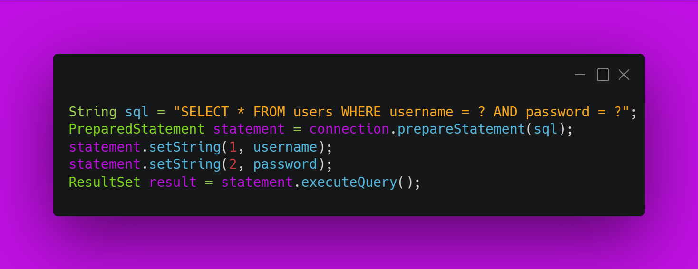
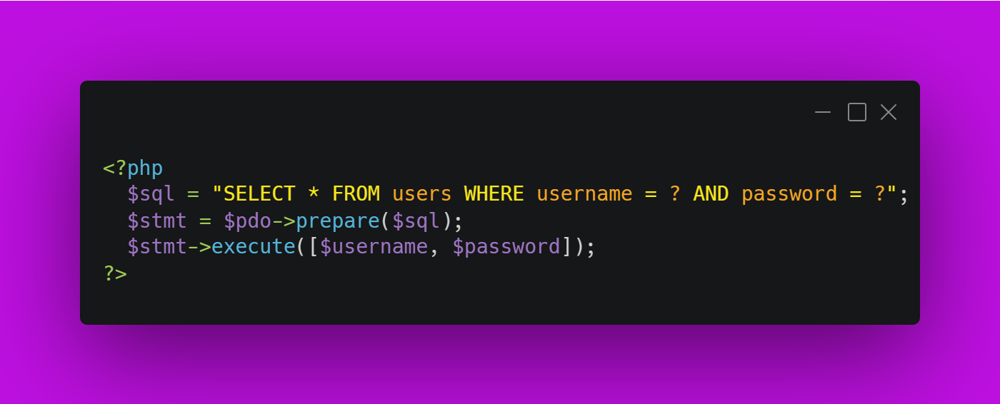
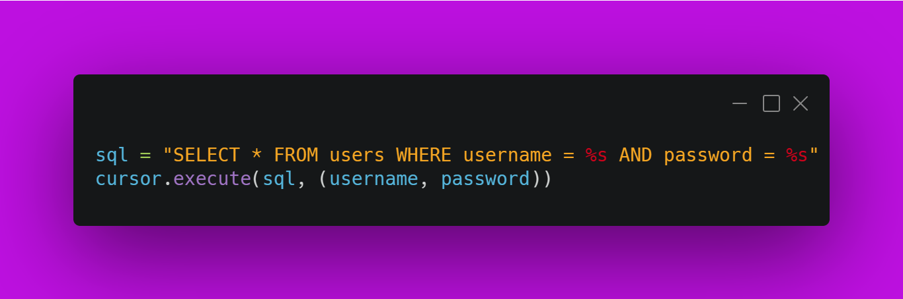
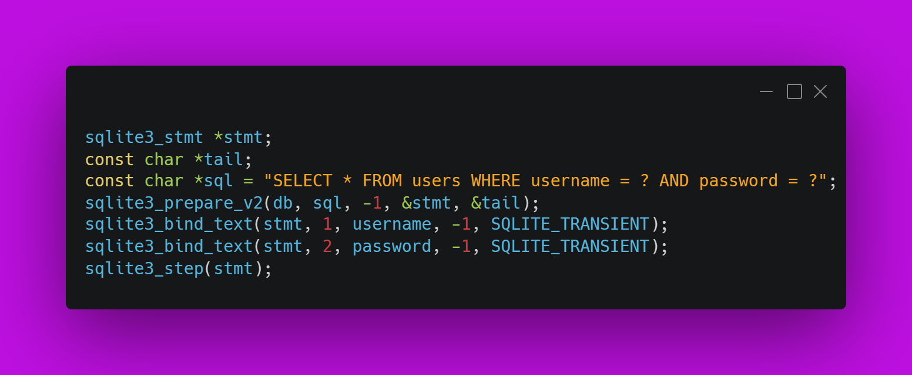
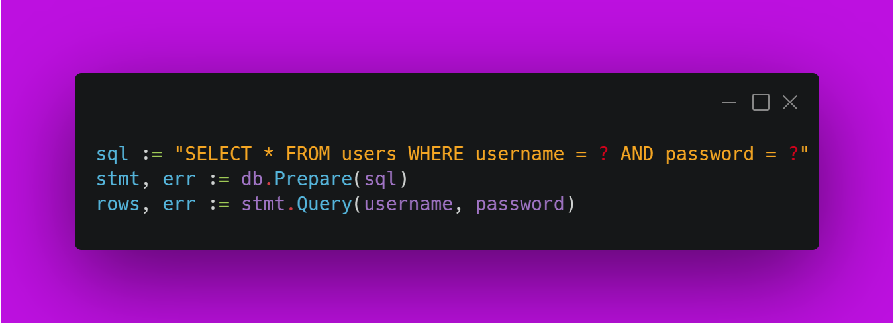
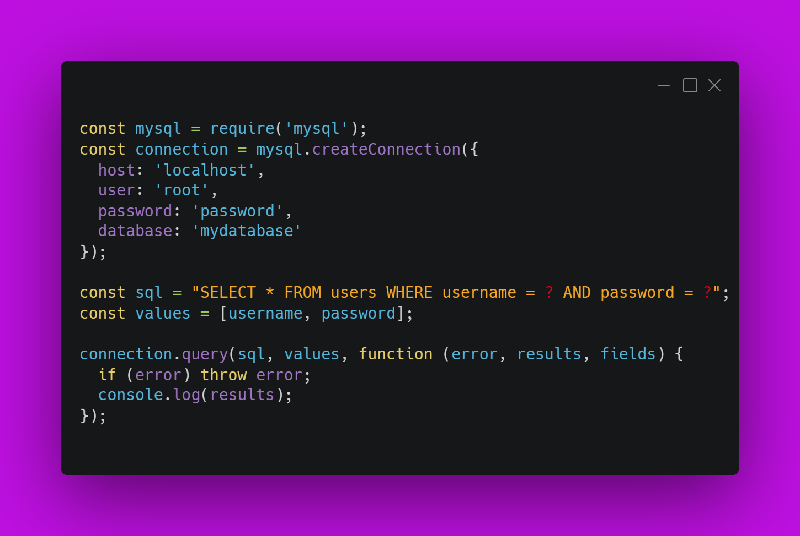

# ¿Cómo puedo evitar la inyección SQL en Java?

## GitHub Copilot

Para evitar la inyección SQL en Java, se recomienda utilizar consultas preparadas <strong>(prepared statements)</strong> en lugar de concatenar directamente los valores de entrada en la consulta SQL. Las consultas preparadas permiten separar la consulta SQL de los valores de entrada, lo que evita que los valores de entrada puedan ser interpretados como parte de la consulta SQL. 

### Aquí te dejo un ejemplo de cómo utilizar una consulta preparada en Java:

En este ejemplo, la consulta <strong>SQL</strong> tiene dos parámetros marcados con signos de interrogación <strong>(?)</strong>, que serán reemplazados por los valores de entrada utilizando los métodos <strong>setString()</strong>. De esta forma, aunque los valores de entrada contengan caracteres especiales, no podrán ser interpretados como parte de la consulta SQL.

> Esta Pregunta ameritaba que lo vieramos en varios lenguajes

### Aquí te dejo algunos ejemplos de cómo utilizar consultas preparadas en diferentes lenguajes de programación:

Para evitar la inyección SQL en otros lenguajes de programación como PHP, Python, C++, Go y Node.js, se recomienda utilizar consultas preparadas (prepared statements) en lugar de concatenar directamente los valores de entrada en la consulta SQL.

<strong>PHP</strong>

<strong>Python</strong>

<strong>C++</strong>

<strong>Go</strong>

<strong>Node.js</strong>

> Si consideras útil esta información, apóyalo haciendo "★ Star" en el repositorio. ¡Gracias 🙌!

## Historia (La Teoria)
En los sistemas de gestión de bases de datos (DBMS), una sentencia preparada, sentencia parametrizada o consulta parametrizada es una función en la que la base de datos precompila el código SQL y almacena los resultados, separándolos de los datos. 

Los beneficios de las sentencias preparadas son:
- Eficiencia, ya que pueden utilizarse repetidamente sin necesidad de volver a compilarlas
- Seguridad, al reducir o eliminar los ataques de inyección SQL

Una sentencia preparada adopta la forma de una plantilla precompilada en la que se sustituyen valores constantes durante cada ejecución, y suele utilizar sentencias SQL DML como INSERT, SELECT o UPDATE.

<strong>Software Soportados</strong>

Los principales DBMSs, incluyendo SQLite, MySQL, Oracle, IBM Db2, Microsoft SQL Server y PostgreSQL soportan sentencias preparadas. Las sentencias preparadas se ejecutan normalmente a través de un protocolo binario no SQL para mayor eficiencia y protección contra la inyección SQL, pero en algunos DBMS como MySQL las sentencias preparadas también están disponibles utilizando una sintaxis SQL para fines de depuración.

Varios lenguajes de programación soportan sentencias preparadas en sus librerías estándar y las emularán en el lado del cliente incluso si el DBMS subyacente no las soporta, incluyendo JDBC de Java, DBI de Perl, PDO de PHP y DB-API de Python. La emulación en el lado del cliente puede ser más rápida para consultas que se ejecutan una sola vez, al reducir el número de idas y vueltas al servidor, pero suele ser más lenta para consultas ejecutadas muchas veces. Resiste con la misma eficacia los ataques de inyección SQL.

Muchos tipos de ataques de inyección SQL pueden eliminarse deshabilitando los literales, lo que requiere el uso de sentencias preparadas; en 2007 sólo H2 soporta esta característica.
