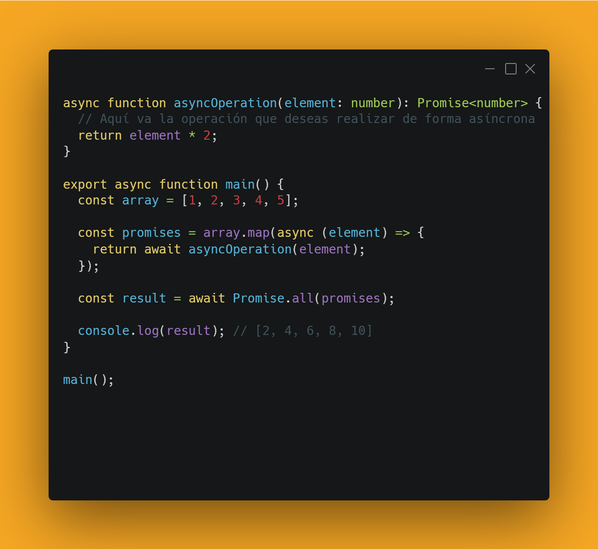
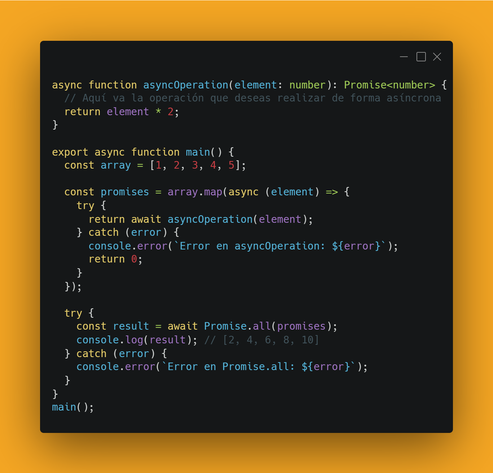

# ¿Cómo usar async await con Array.map en TypeScript?

## GitHub Copilot

Para usar async/await con Array.map en TypeScript, puedes hacer lo siguiente:

1. Define una función async que realizará la operación que deseas en cada elemento del array.
2. Usa Array.map para crear un nuevo array con los resultados de la función async.
3. Usa Promise.all para esperar a que todas las promesas se resuelvan.

### Aquí te dejo un ejemplo de cómo hacerlo:

En este ejemplo, la función asyncOperation realiza una operación simple de multiplicar el elemento por 2. Luego, en la función main, usamos Array.map para crear un nuevo array con los resultados de la función asyncOperation. Finalmente, usamos Promise.all para esperar a que todas las promesas se resuelvan y obtenemos el resultado final.

### Como puedo manejar los errores cuando estoy usando async/await con Array.map en TypeScript

Para manejar los errores cuando estás usando async/await con Array.map en TypeScript, puedes envolver el código dentro de un bloque try/catch. De esta manera, puedes capturar cualquier error que se produzca durante la ejecución de la función asíncrona y manejarlo de forma adecuada.

### Aquí te dejo un ejemplo de cómo hacerlo:

En este ejemplo, envolvemos el código dentro de un bloque try/catch tanto en la función asyncOperation como en la función main. En la función asyncOperation, capturamos cualquier error que se produzca durante la ejecución de la función y lo manejamos imprimiendo un mensaje de error en la consola y devolviendo un valor predeterminado (0 en este caso).

En la función main, envolvemos el código dentro de un bloque try/catch para capturar cualquier error que se produzca durante la ejecución de las promesas. Si se produce un error, lo manejamos imprimiendo un mensaje de error en la consola.

Es importante tener en cuenta que, al manejar los errores de esta manera, la ejecución del código no se detendrá si se produce un error en una de las promesas. En su lugar, se manejará el error y se continuará con la ejecución del resto de las promesas.

### Para usar el código que les comparto, sigue estos pasos:
 - Crea un archivo TypeScript con el código que compartí y guárdalo con el nombre que quieras ejemplo question_5.ts
 - Crea un archivo tsconfig.json con el código que compartí en la misma carpeta que está question_5.ts
 - Abre una terminal en la carpeta donde guardaste el archivo TypeScript y ejecuta el comando tsc. Esto compilará el archivo TypeScript y generará un archivo JavaScript con el mismo nombre (question_5.js).
 - Puedes ejecutar con Node.js usando el comando node question_5.js. 

> Si consideras útil esta información, apóyalo haciendo "★ Star" en el repositorio. ¡Gracias 🙌!

## Historia
Async y Await son estándar desde ECMAScript 8 (2017).
Await tiene algunos problemas en la versión ECMAScript 8 (2017).
Será corregido en ECMAScript 9 (2018)

TypeScript fue publicado en octubre de 2012, después de dos años de desarrollo por parte de Microsoft.

TypeScript 0.9, lanzado en 2013, agregó soporte para genéricos. La versión 1.0 de TypeScript fue publicada en la conferencia de desarrolladores Build de Microsoft en 2014.

En julio de 2014, el equipo de desarrollo de TypeScript anunció un nuevo compilador que era 5 veces más rápido al actual. Inicialmente estaba alojado en CodePlex, luego lo movieron a GitHub.

El 22 de septiembre de 2016, se lanzó TypeScript 2.0. Esta versión introdujo varias características, entre ellas la capacidad de evitar la asignación a nulo de las variables.
