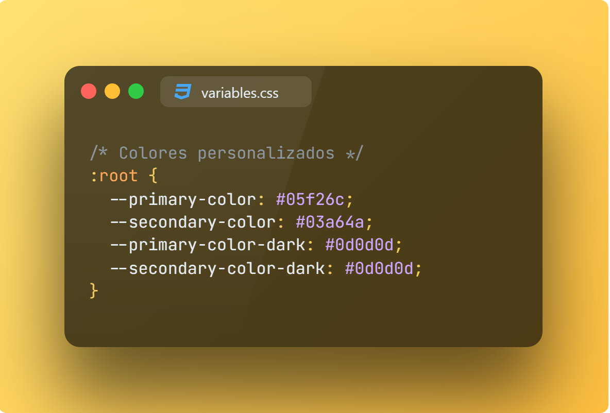
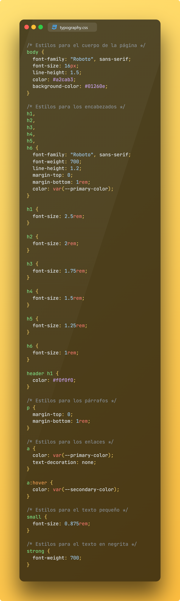
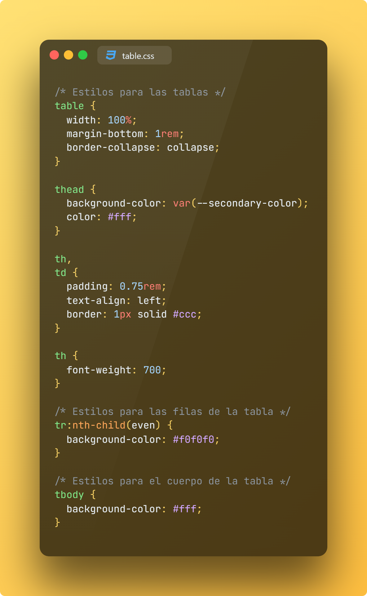

# Basado en material design crea el css para las siguientes etiquetas: body, h1, h2, h3, h4, h5, h6, section, blockquote, div, hr, li, ol, p, pre, ul, a, small, strong, img, table, tbody, td, th, thead, tr, header, nav, main, footer y button. primary color #05F26C y secondary color #60BF89 y agrega la fuente Roboto

## GitHub Copilot
Aquí te proporciono un ejemplo de cómo podrías crear un archivo CSS basado en Material Design para las etiquetas que mencionaste, utilizando los colores primario y secundario y la fuente Roboto que proporcionaste:

> Ya que es mucho código se dividió en secciones

### Seccionamiento de Variables

### Seccionamiento de Barra de Navegación
 

### Seccionamiento de Botones

### Seccionamiento de la Tipografía

### Seccionamiento de Estructuras

### Seccionamiento de Tabla

### Aquí te dejo el código seccionado:
 - [Código en Variables](./css/variables.css)
 - [Código en Navegación](./css/nav.css)
 - [Código en Botones](./css/buttons.css)
 - [Código en Tipografía](./css/typography.css)
 - [Código en Estructuras](./css/layout.css)
 - [Código en Tabla](./css/table.css)

[Código Completo](./question_6.css)

[Demo HTML](./index.html)

> Si consideras útil esta información, apóyalo haciendo "★ Star" en el repositorio. ¡Gracias!

## Historia
Material Design (nombre en código Quantum Paper)​ es un lenguaje de diseño desarrollado por Google en 2014. Ampliando las "tarjetas" que debutaron en Google Now, Material Design utiliza más diseños basados ​​en cuadrículas, animaciones y transiciones receptivas, relleno y profundidad, efectos como luces y sombras. Google anunció Material Design el 25 de junio de 2014, en la conferencia Google I/O de 2014.

En 2018, Google detalló una renovación del lenguaje, con un enfoque en brindar más flexibilidad a los diseñadores para crear "temas" personalizados con geometría, colores y tipografía variables. Google lanzó Material Theme Editor exclusivamente para la aplicación de diseño de macOS Sketch.
