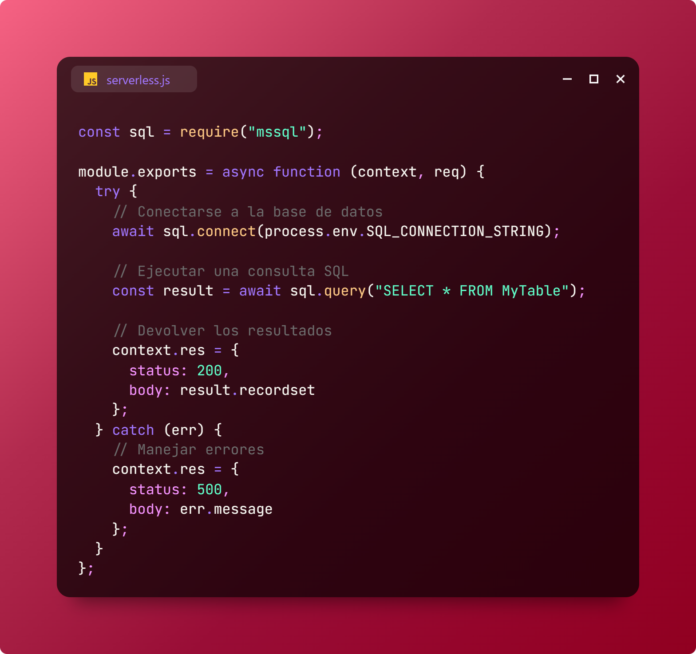
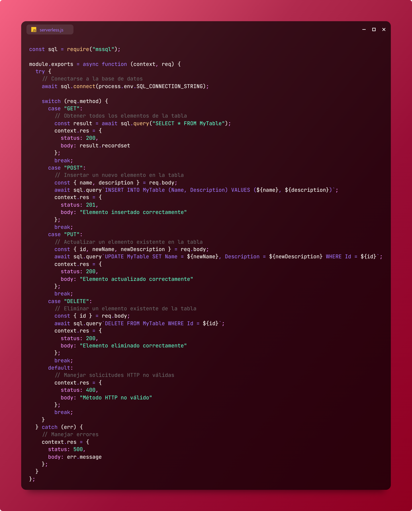

# Crea un serverless REST API con Funciones en Azure, Node y Azure SQL

## GitHub Copilot
Para crear una REST API serverless con Funciones en Azure, Node y Azure SQL, puedes seguir los siguientes pasos:

1. Crea una cuenta de Azure y un grupo de recursos.
2. Crea una instancia de Azure SQL y una base de datos.
3. Crea una función de Azure en Node.js.
4. Agrega la cadena de conexión de la base de datos a la configuración de la función.
5. Crea las funciones HTTP para manejar las solicitudes GET, POST, PUT y DELETE.
6. Usa el módulo <strong>mssql</strong> de Node.js para conectarte a la base de datos y ejecutar consultas SQL.
7. Implementa la función en Azure.

### Aquí hay un ejemplo de cómo podrías implementar la función HTTP GET para obtener todos los elementos de una tabla en la base de datos:

Recuerda que debes agregar la cadena de conexión de la base de datos a la configuración de la función en Azure. También debes implementar las funciones HTTP restantes para manejar las solicitudes POST, PUT y DELETE.

## Dame un ejemplo completo de como puedo implementar la funcion HTTP GET, POST, PUT y DELETE

¡Claro! Aquí te dejo un ejemplo completo de cómo podrías implementar las funciones HTTP GET, POST, PUT y DELETE en una función de Azure en Node.js para manejar una tabla en una base de datos de Azure SQL:

Recuerda que debes agregar la cadena de conexión de la base de datos a la configuración de la función en Azure. También debes asegurarte de que la solicitud HTTP incluya los datos necesarios en el cuerpo de la solicitud para las solicitudes POST, PUT y DELETE.

> Si consideras útil esta información, apóyalo haciendo "★ Star" en el repositorio. ¡Gracias!

## Historia
<strong>La Presentación de Azure Functions por parte de Chris Anderson en la conferencia anual de Microsoft Build 2016, especificamente de fecha 25 mar 2016</strong>

Azure Functions presenta una experiencia basada en eventos y proceso a petición que se basa en la plataforma PaaS líder en el mercado de Azure. Venga y experimente cómo Azure Functions amplía la infraestructura existente de WebJobs para permitirle implementar fácilmente código en una variedad de lenguajes que reaccionan a los eventos generados a partir de la amplitud de los servicios de Azure, los productos SaaS y los sistemas locales. Vea cómo puede compilar e implementar Azure Functions escritos en JavaScript, C#, Python y PHP mediante una interfaz de usuario intuitiva basada en explorador para responder a eventos generados por Blob Storage, Table Storage, Colas de Azure, Service Bus, Event Hubs, solicitudes HTTP o temporizadores. Azure Functions ushers en una nueva opción para el desarrollo de PaaS, no te pierdas ser el primero en experimentarlo!!!

