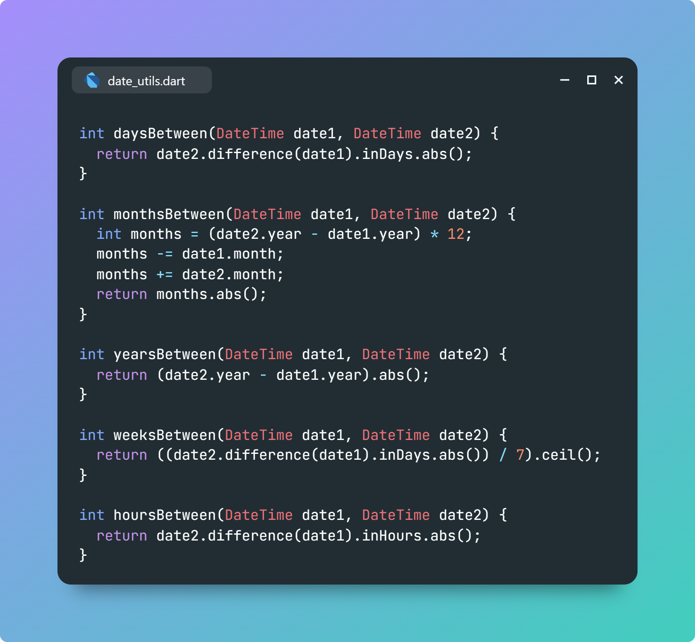
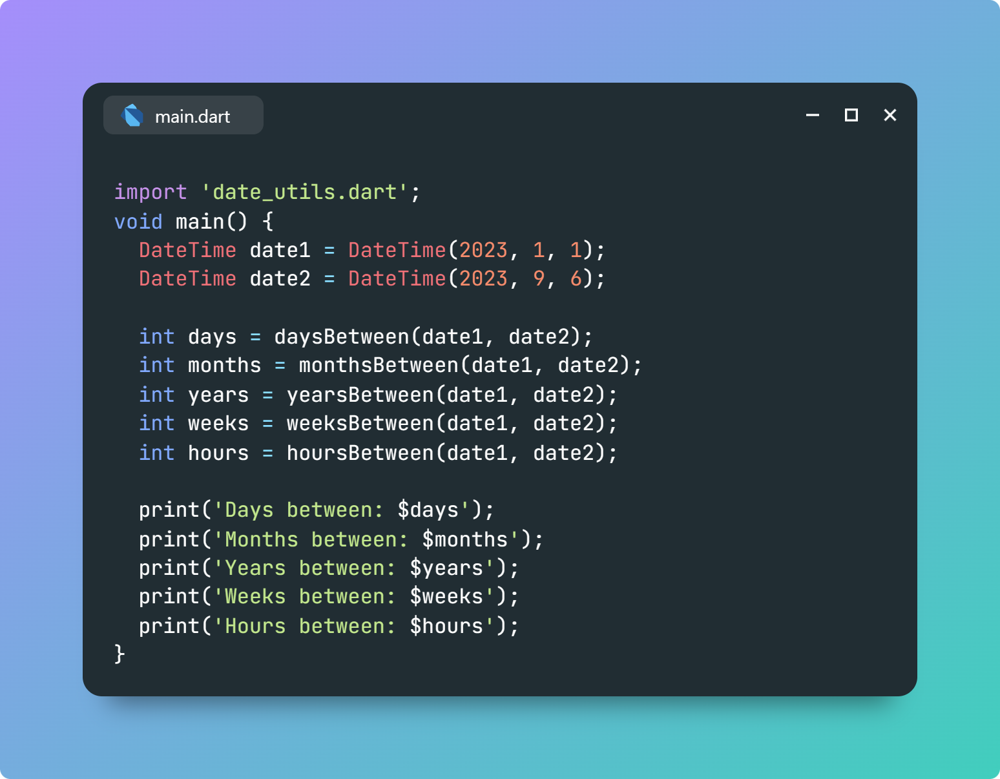
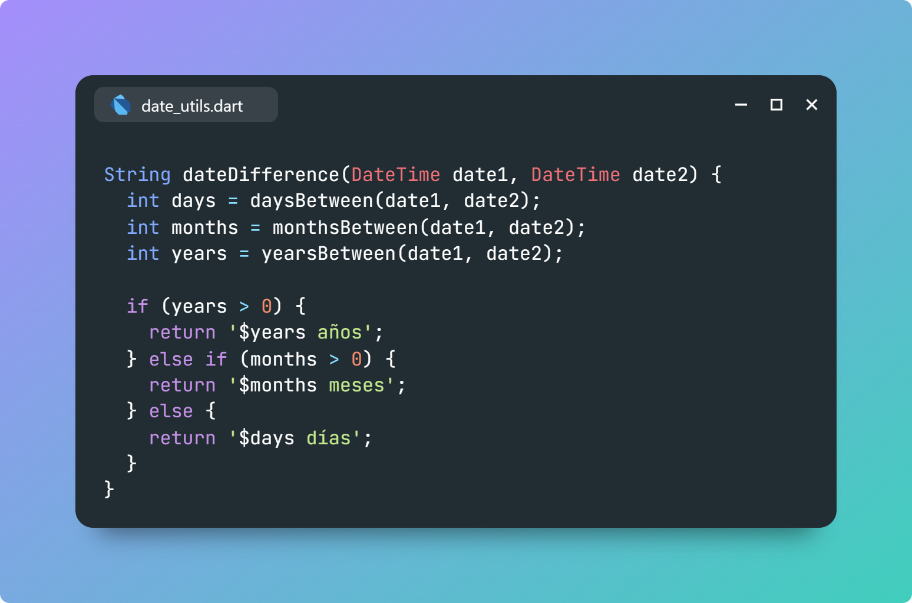

# Programa funciones en Dart donde se establezcan los siguientes calculos entre fechas: Días transcurridos entre dos fechas, Meses transcurridos entre dos fechas, Años transcurridos entre dos fechas, Semanas transcurridas entre dos fechas, Horas transcurridas entre dos fechas

## GitHub Copilot
Para calcular los días, meses, años, semanas y horas transcurridos entre dos fechas en <strong>Dart</strong>, podemos utilizar la clase <strong>DateTime</strong> y realizar algunas operaciones matemáticas.

### Aquí te dejo un ejemplo de cómo podrías implementar estas funciones:



Estas funciones reciben dos parámetros de tipo <strong>DateTime</strong> que representan las fechas que queremos comparar. Cada función realiza una operación matemática diferente para calcular el tiempo transcurrido entre ambas fechas, y devuelve un valor entero correspondiente al resultado de la operación.

## Cómo usar estas funciones en mi código Dart

Para usar estas funciones en tu código Dart, primero debes asegurarte de que estén definidas en un archivo separado (por ejemplo, <strong>date_utils.dart</strong>) y que ese archivo esté en el mismo directorio que tu archivo principal.

Luego, en tu archivo principal, puedes importar las funciones utilizando la siguiente sintaxis:

```import 'date_utils.dart';```

Una vez que hayas importado el archivo, puedes llamar a cualquiera de las funciones que hayas definido en él. Por ejemplo:



Este código crea dos objetos <strong>DateTime</strong> que representan el 1 de enero y el 10 de septiembre de 2023, respectivamente. Luego, llama a cada una de las funciones para calcular el tiempo transcurrido entre ambas fechas y almacena los resultados en variables. Finalmente, imprime los resultados en la consola.

```
Días transcurridos: 248
Meses transcurridos: 8
Años transcurridos: 0
Semanas transcurridos: 36
Horas transcurridos: 5952
```

## Programa una función en dart que calcule la diferencia de dos fechas y devuelva años meses o dias según su diferencia y usa de las funciones anteriores int days = daysBetween(date1, date2); int months = monthsBetween(date1, date2); int years = yearsBetween(date1, date2);

Claro, aquí te dejo una función en Dart que utiliza las funciones <strong>daysBetween, monthsBetween</strong> y <strong>yearsBetween</strong> para calcular la diferencia entre dos fechas y devolver el resultado en años, meses o días:



Esta función recibe dos parámetros de tipo <strong>DateTime</strong> que representan las fechas que queremos comparar. La función utiliza las funciones <strong>daysBetween, monthsBetween</strong> y <strong>yearsBetween</strong> para calcular la diferencia entre ambas fechas en días, meses y años, respectivamente.

Luego, la función utiliza una estructura condicional para determinar si la diferencia es mayor a un año, mayor a un mes o menor a un mes, y devuelve una cadena de texto que indica la diferencia entre las dos fechas en años, meses o días, según corresponda.

Por ejemplo, si llamamos a la función con las fechas <strong>DateTime(2021, 1, 1)</strong> y <strong>DateTime(2021, 12, 31)</strong>, la función devolverá la cadena '8 meses', ya que la diferencia entre ambas fechas es menor a un año y mayor a un mes.

```Han Transcurrido: 8 meses```

> Si consideras útil esta información, apóyalo haciendo "★ Star" en el repositorio. ¡Gracias!

## Historia
Dart (originalmente llamado Dash) es un lenguaje de programación de código abierto, desarrollado por Google. Fue revelado en la conferencia goto; en Aarhus, Dinamarca el 10 de octubre de 2011.​ El objetivo de Dart no es reemplazar JavaScript como el principal lenguaje de programación web en los navegadores web, sino ofrecer una alternativa más moderna. El espíritu del lenguaje puede verse reflejado en las declaraciones de Lars Bak, ingeniero de software de Google, que define a Dart como un “lenguaje estructurado pero flexible para programación Web”.

En Dart, la clase <strong>DateTime</strong> está disponible en la biblioteca <strong>dart:core</strong> y se utiliza para representar un instante en el tiempo, como el 20 de julio de 1969, 8:18pm GMT. Los <strong>DateTimes</strong> pueden representar valores de tiempo que están a una distancia de hasta 100,000,000 días desde la época (1970-01-01 UTC): -271821-04-20 a 275760-09-13. Puedes crear un objeto <strong>DateTime</strong> utilizando uno de los constructores o analizando una cadena correctamente formateada, que cumpla con un subconjunto de <strong>ISO 8601</strong>.
