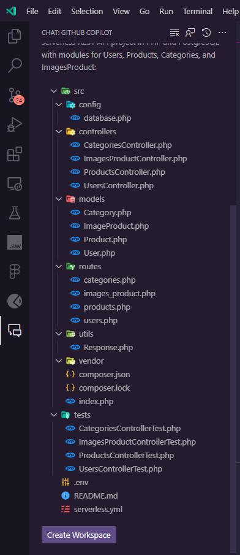
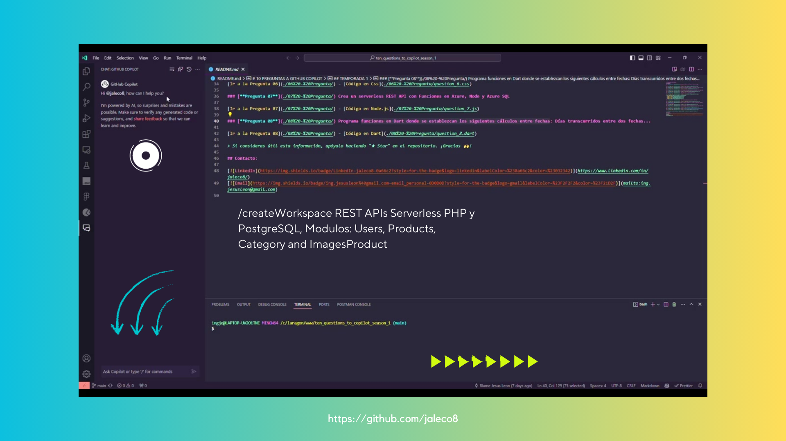

# /createWorkspace serverless REST APIs en PHP y PostgreSQL con los Modulos Users, Products, Categories y ImagesProduct

## GitHub Copilot
Claro, aquí tienes una propuesta de estructura de directorios para un proyecto de API REST sin servidor en PHP y PostgreSQL con módulos para Usuarios, Productos, Categorías e ImagesProduct:

### DEMO 

> Si consideras útil esta información, apóyalo haciendo "★ Star" en el repositorio. ¡Gracias!

## Historia
<strong>Nuevos comandos Crear en Visual Studio Code 1.80</strong>
GitHub Copilot - Actualización del 14 de julio del 2023. Para ayudarte a crear proyectos y blocs de notas y a buscar texto en tu espacio de trabajo, hemos introducido comandos de barra en la vista Chat.

<strong>Crear espacios de trabajo</strong>
Puedes pedir a Copilot que cree espacios de trabajo para los tipos de proyecto más populares con el comando ``/createWorkspace``. Copilot generará primero una estructura de directorios para su solicitud.
