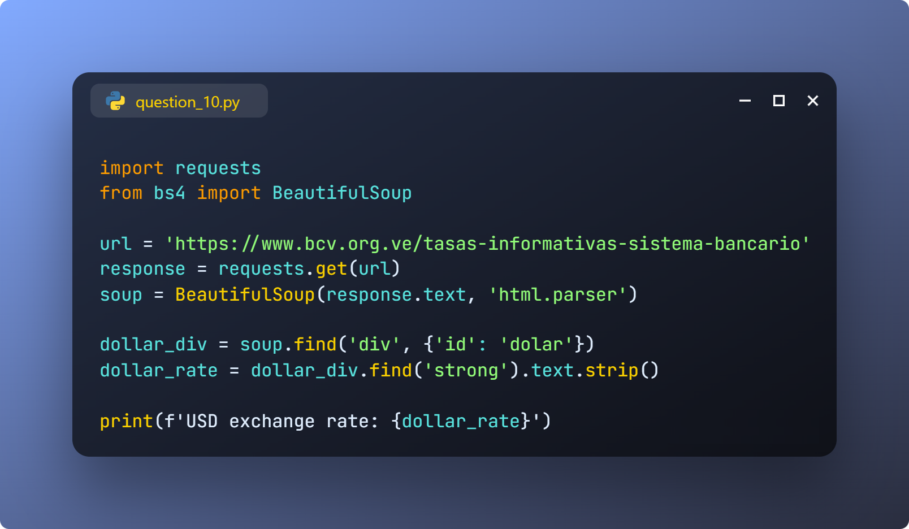
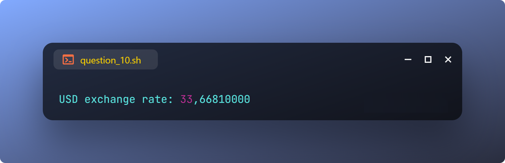

# crea un programa en phyton que se conecte a la web https://www.bcv.org.ve/tasas-informativas-sistema-bancario e imprima únicamente el tipo de cambio en dolar ejemplo:  33,66810000 

## GitHub Copilot

He aquí un programa Python de ejemplo que utiliza las bibliotecas <strong>requests</strong> y <strong>BeautifulSoup</strong> para conectarse al sitio web y extraer el tipo de cambio en dólares:

### Aquí te dejo el código en Python:

Este programa envía una petición GET al sitio web, extrae el contenido HTML utilizando BeautifulSoup, encuentra el elemento <strong>div</strong> con <strong>id="dolar"</strong>, y luego extrae el tipo de cambio del elemento <strong>strong</strong> dentro de ese <strong>div</strong>. A continuación, el programa imprime el tipo de cambio en la consola.

### Aqui puedes ver el resultado del programa:

> Si consideras útil esta información, apóyalo haciendo "★ Star" en el repositorio. ¡Gracias 🙌!

## Historia

Web scraping es una técnica utilizada mediante programas de software para extraer información de sitios web. Usualmente, estos programas simulan la navegación de un humano en la World Wide Web ya sea utilizando el protocolo HTTP manualmente, o incrustando un navegador en una aplicación.

En los últimos años el web scraping se ha convertido en una técnica muy utilizada dentro del sector del posicionamiento web gracias a su capacidad de generar grandes cantidades de datos para crear contenidos de calidad.

El web scraping podría ir en contra de los términos de uso de algunos sitios webs. El cumplimiento de estos términos no está totalmente claro. Si el sitio web de destino publica un archivo de política de uso aceptable, los términos de uso del web scraping podrían estar especificados allí. En caso contrario, el web scraping podría estar en una zona gris desde el punto de vista legal.
